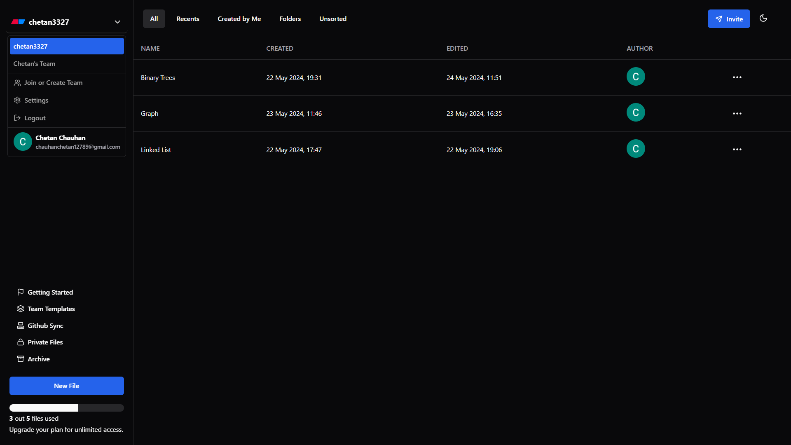
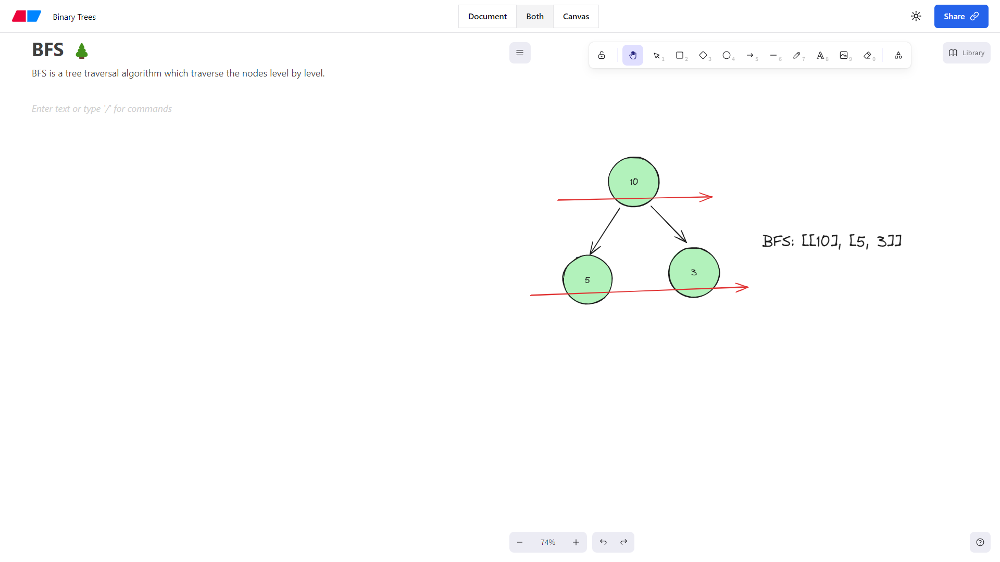

<!-- ABOUT THE PROJECT -->
# Eraser.io clone
### dashboard

### workspace


This Eraser.io clone offers a digital whiteboard experience where users can create and organize notes and manage tasks efficiently. It features versatile drawing tools and intuitive note management, providing a streamlined platform for personal and team use.

Use the `README.md` to get started.

<!-- BUILT WITH -->
# Built With

The Tech Stacks used are:

<div align="center">
  <a href="https://skillicons.dev">
      
  </a>
</div>

## Installation

1. Clone the repository to your local machine:

   ```bash
   git clone https://github.com/Chetan3327/eraser.io.git
   ```
2. Navigate to the directory:

   ```bash
   cd eraser.io
   ```
3. Install dependencies:

   ```bash
   npm install
   ```
4. run the development server:

   ```bash
   npm run dev
   ```

<!-- CONTACT -->
# Contact

<ul>
   <li>Name: Chetan Chauhan</li>
   <li>Mail: chauhanchetan12789@gmail.com</li>
   <li>Linkedin: https://www.linkedin.com/in/chetan3327/</li>
   <li>Project Link: https://eraser3327.vercel.app/</li>
</ul>
